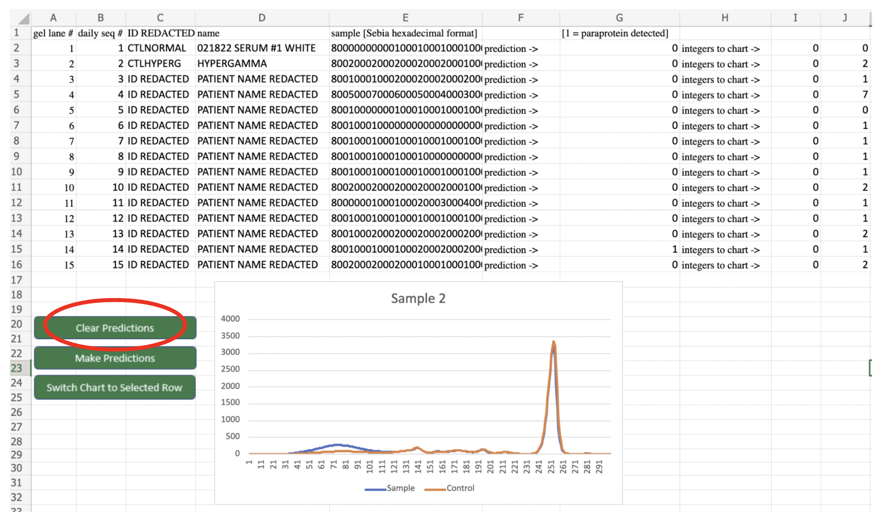
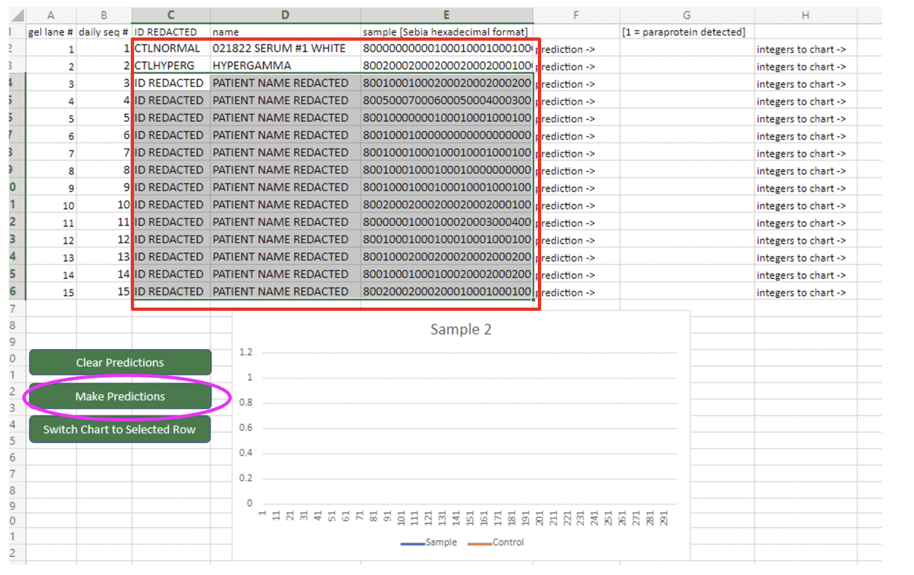
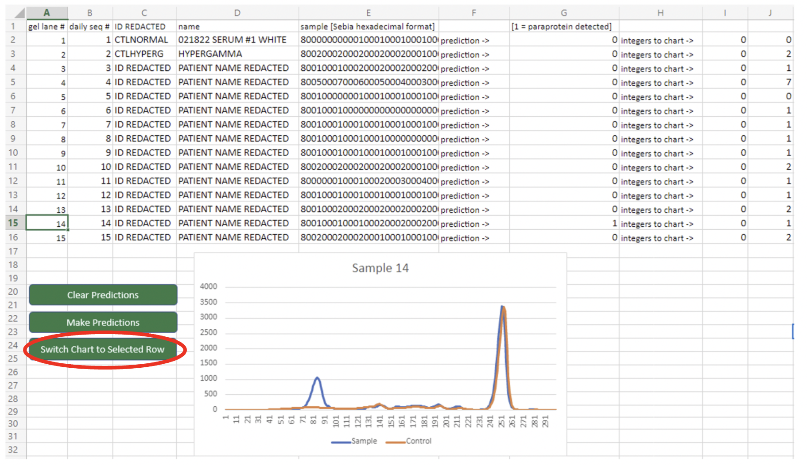

# Serum protein electrophoresis paraprotein screening tool


## About

We provide a method for screening SPEPs for paraproteins.
The model parameters used for this tool were tuned based on a private dataset of samples from the authors' clinical laboratory. 

### Required software and packages

The tool requires usage of `python3`, and the packages `numpy`, `scikit-learn`, and `pandas` (see `requirements.txt`). An environment for running the code is provided in `/env` (see instructions this page). 

## Usage - Scoring the model on input data

The method takes as input, a serum protein electrophoresis densitometry curve as well as an associated control densitometry curve (does not contain a paraprotein). 


### Input format

Input file with columns:

* **sebiaSerumCurve**: string in hexadecimal format for serum curve from Sebia device
* **sebiaSerumGelControlCurve**: string in hexadecimal format for control curve from Sebia device

Sample input file is in `data/sample_input_data.csv`

### Steps to run screening tool
#### Step 1

If your setup does not include the required Python version and packages, a virtual environment is provided in `/env`. The environment can be initialized with the following:

```
source env/bin/activate
```

#### Step 2

##### Option 1: Run the algorithm with input sample and control gel curves in hexadeximal format

```
python paraprotein_screen.py data/sample_input_data_hex.csv
```

Output will be generated by default in `./output.csv` and `./output.json`. The output will also be directed to STDOUT in `JSON` format.

Each item in output will have the following:

* **sebiaSerumCurve**: string in hexadecimal format for serum curve from Sebia device
* **sebiaSerumGelControlCurve**: string in hexadecimal format for control curve from Sebia device
* **sebiaSerumCurve_intArr**: serum curve as integer array 
* **sebiaSerumGelControlCurve_intArr**: control curve as integer array
* **gamma_region_cutoff**: index of element in integer array that delimits the gamma region (identified from control)
* **prediction**: predicted paraprotein status (1 = positive prediction, 0 = negative prediction)

##### Option 2: Run the algorithm with input sample and control gel curves in integer format

```
python paraprotein_screen.py data/sample_input_data_int.csv --input_int 1
```

The input data file contains columns:

* **sebiaSerumCurve_intArr**: serum curve as integer array 
* **sebiaSerumGelControlCurve_intArr**: control curve as integer array
* **gamma_region_cutoff**: index of element in integer array that delimits the gamma region (identified from control)

Output will be generated by default in `./output.csv` and `./output.json`. The output will also be directed to STDOUT in `JSON` format.

Each item in output will have the following:

* **sebiaSerumCurve_intArr**: serum curve as integer array 
* **sebiaSerumGelControlCurve_intArr**: control curve as integer array
* **gamma_region_cutoff**: index of element in integer array that delimits the gamma region (identified from control)
* **prediction**: predicted paraprotein status (1 = positive prediction, 0 = negative prediction)

## Usage - calibrating the model on sample data


## Usage - Microsoft Office Excel 365 script for automated SPEP scoring

### Step 1

Download the spreadsheet file (office365_spep_predictor_v2.xlsx) and upload into Excel 365 online. 

### Step 2

Click the "Clear Predictions" button to clear populated data for predictions in sample curves in the sheet.



### Step 3

Copy and paste sample information (may include sample ID, patient name, and densitometry curve in hexadecimal format) into column C/D/E from row 2 onwards. In our sample file, the input represents 15 lanes on a gel. Lane 1 is a negative control without a paraprotein. Lane 2 is a control containing hypergammaglobulinemia. After data is populated, click the "Make Predictions" button which will call the script to send a POST request to our API, thereby scoring each sample; subsequently, the predictions will populate in column G. Columns I-onwards are populated solely so that the spreadsheet can allow for charts to be drawn; they are not to be used by the user. 




### Step 4

Click the "Switch Chart to Selected Row" button to draw a plot of the sample and control together for the particular row in which a cell has been selected. 


